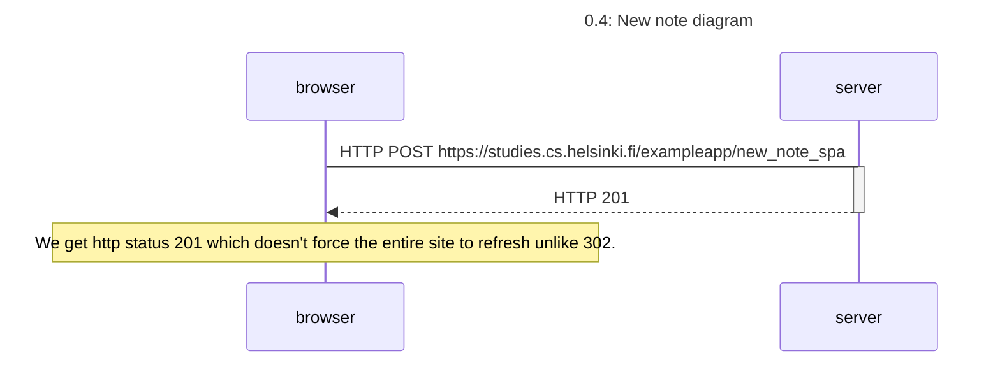

```mermaid
sequenceDiagram
    Title: 0.4: New note diagram
    participant browser
    participant server


    browser->server: HTTP POST https://studies.cs.helsinki.fi/exampleapp/new_note_spa
    activate server
    server -->> browser: HTTP 201
    deactivate server
    note over browser: We get http status 201 which doesn't force the entire site to refresh unlike 302.


```